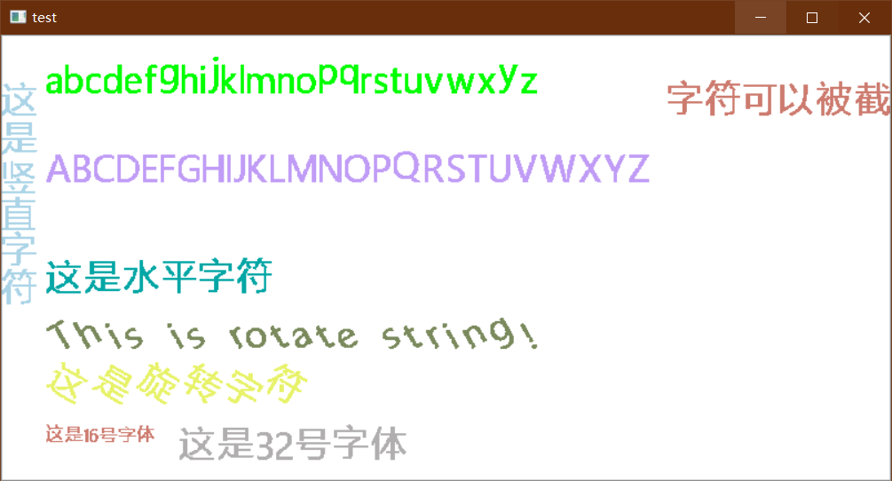

# freetype_opencv

----

更新：2019-11-2

* 使用 OpenCV 4.1
* 使用 freetype 2.10.1
* 支持 竖向文字、旋转文字

配置说明： [OpenCV 在图像中显示中文](https://github.com/busyboxs/freetype_opencv/blob/master/opencv_puttext_zh.md)

使用说明：直接打开 `opencv_puttext_zh` 文件夹下的解决方案，配置好依赖环境运行即可。`freetype_test` 为原来版本的文件夹，现在已经没用啦。



----

**以下为源项目内容**

OpenCV自带的cvInitFont和cvPutText(putText)函数不支持向图像中写入中文，需要使用FreeType库来进行汉字显示。

FreeType(https://www.freetype.org/) 库是开源的、高质量的且可移植的字体引擎，它提供统一的接口来访问多种字体格式文件。

# freeType环境配置（windows下vs2013）
1. 从官网下载好源代码后，进入到 E:\freetype-2.6.2\builds\windows(根据个人存放位置和下载的版本情况有所不同)，由于我电脑使用的是VS2013，而该文件夹下并没有VS2013
的工程文件，直接复制vc2010文件夹，并改为vc2013，用VS2013打开文件夹下面的freetype.sln,系统会提示更新，打开后的工程就是vc2013工程了。

2. 根据你的需要，选择Debug或者Release，win32或者X64，然后编译生成，就会在E:\freetype-2.6.2\objs\vc2010文件夹里生成相应的lib文件。
3. 更改本项目的属性，需要修改的总共有三处：
* VC++目录 ---> 包含目录  ：E:\freetype-2.6.2\include（根据自己文件夹放的位置不同而不同，视情况修改）
* VC++目录 ---> 库目录：E:\freetype-2.6.2\objs\vc2010（就是第2步中lib生成的目录）
* 链接器 ---> 附加依赖项 ：添加freetype22.lib；freetype262d.lib（就是第2步中生成的lib的名称，freetype22.lib为Release模式，freetype22d.lib为Debug模式）


注：由于我用的OpenCV3.0且在其他地方使用的opencv Mat来读取的图片，而这里的putText针对的是IplImage的数据，所以我先将Mat转换为了IplImage，等在图片上画了中文后，又将IplImage转换为Mat。如果只为为了在图片上显示中文，可以直接使用IplImage读显图片。
此时主函数如下

```C
#include <ft2build.h>
#include FT_FREETYPE_H
#include <iostream>
#include "CvxText.h"
using namespace std;

int main(int argc, char *argv[])
{
	IplImage *img = cvLoadImage("lena.jpg");
	const char* msg = "这里可以输入汉字哦！";
	CvxText text("C:\\Windows\\Fonts\\simkai.ttf");
	text.putText(img, msg, CvPoint(100, 100), CvScalar(0, 255, 255));
	cvShowImage("test", img);
	cvWaitKey(-1);
	cvReleaseImage(&img);
	return 0;
}
```
