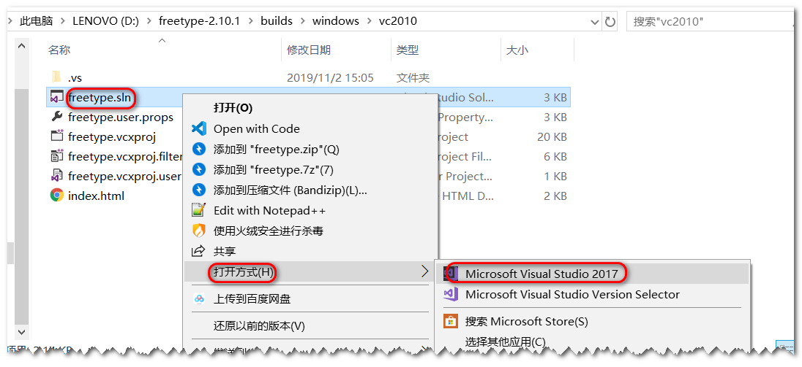
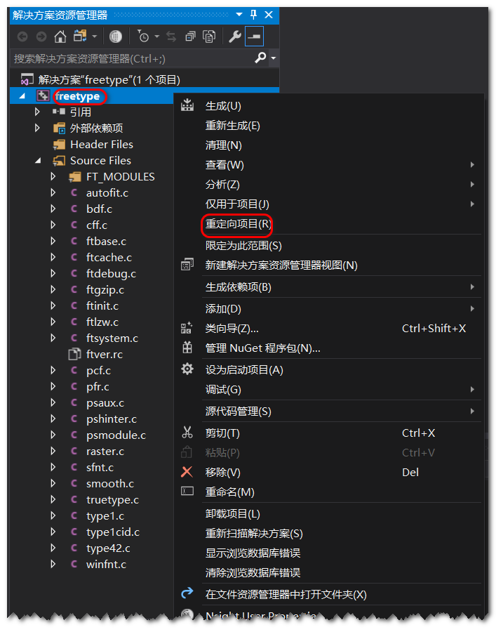
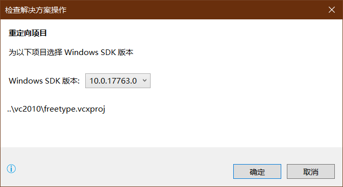
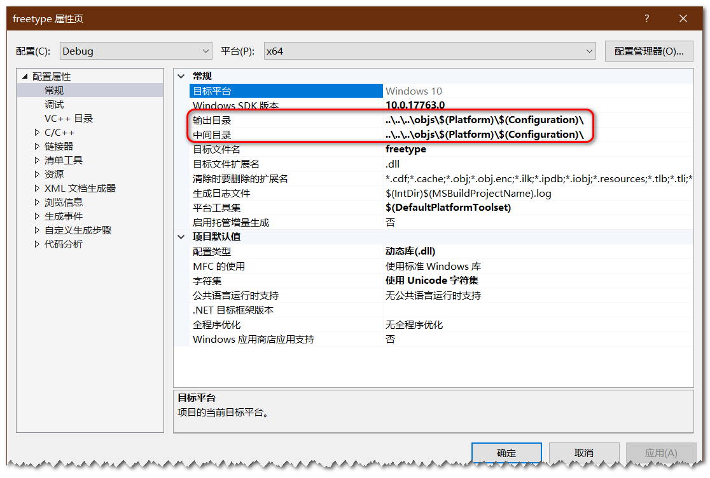
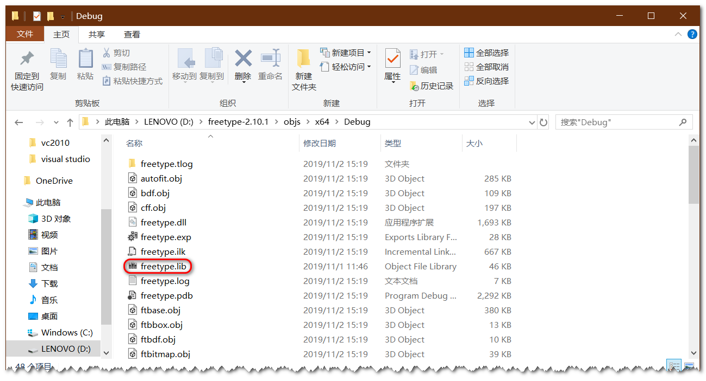
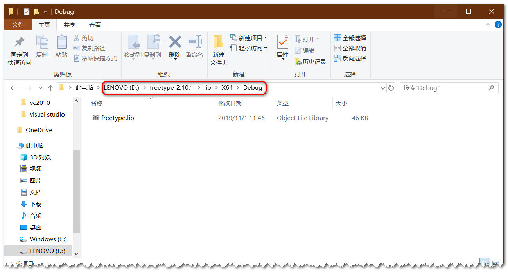

# OpenCV 在图像中显示中文

## 本机环境

* Windows 10
* Visual Studio Community 2017 (version 15.9.17)
* OpenCV 4.1.2
* freetype 2.10.1

## OpenCV 环境配置

OpenCV 环境的配置可以参见我的另外一篇博客：[Visual Studio Opencv 环境配置 - 手动配置]()

## freetype 环境配置

首先下载 freetype 文件。下载地址：[FreeType Downloads](https://www.freetype.org/download.html)

然后将文件解压，我这里解压到 D 盘


然后找到 `~\build\windows\vs2010` 路径，鼠标右键 `freetype.sln`，用 Visual Studio 打开。



然后鼠标右键项目名 `freetype`，选择 “重定向项目”。



然后点击 “确定”。



然后查看项目的属性，可以看到链接文件的输出路径



这里可以选择不同的配置（Debug & Release）和平台（Win32 & x64），然后运行项目就可以生成对应配置和平台的连接文件。



最终我们需要的是 `freetype.lib` 文件，为了方便我把该文件复制到了 `~\lib\X64\Debug\`



## Visual Studio 配置

Visual Studio 中需要配置包含目录，库目录和链接器输入的附加依赖库。

* 包含目录为： `D:\freetype-2.10.1\include`
* 库目录为：   `D:\freetype-2.10.1\lib\X64\Debug`
* 附加依赖库： `freetype.lib`

如何配置可以参见我的另外一篇博客：[Visual Studio Opencv 环境配置 - 手动配置]()。

## 测试代码

```cpp
#include <ft2build.h>
#include FT_FREETYPE_H
#include <iostream>
#include "CvxText.h"

using namespace std;

static cv::Scalar randomColor(cv::RNG& rng)
{
	int icolor = (unsigned)rng;
	return cv::Scalar(icolor & 255, (icolor >> 8) & 255, (icolor >> 16) & 255);
}

int main(int argc, char *argv[])
{
	cv::RNG rng(0xFFFFFFFF);

	// create a white background
	cv::Mat img(400, 800, CV_8UC3, cv::Scalar(255, 255, 255));
	
	// be careful to use the font that support Chinese 
	CvxText text("./font/msyh.ttc");
	text.setFontSize(32);

	const char* msg = "abcdefghijklmnopqrstuvwxyz";
	text.putText(img, msg, cv::Point(40, 20), cv::Scalar(0, 255, 0));

	const char* msg1 = "ABCDEFGHIJKLMNOPQRSTUVWXYZ";
	text.putText(img, msg1, cv::Point(40, 100), randomColor(rng));

	const char* msg2 = "这是水平字符";
	text.putText(img, msg2, cv::Point(40, 200), randomColor(rng));

	const char* msg3 = "这是竖直字符";
	text.putText(img, msg3, cv::Point(0, 40), randomColor(rng), true);

	const char* msg4 = "This is rotate string!";
	text.setFontSize(32, 30);
	text.putText(img, msg4, cv::Point(40, 250), randomColor(rng));

	const char* msg5 = "这是旋转字符";
	text.setFontSize(32, -30);
	text.putText(img, msg5, cv::Point(40, 300), randomColor(rng));

	const char* msg6 = "字符可以被截断";
	text.setFontSize(32);
	text.putText(img, msg6, cv::Point(600, 40), cv::Scalar(111, 123, 205));

	const char* msg7 = "这是16号字体";
	text.setFontSize(16);
	text.putText(img, msg7, cv::Point(40, 350), cv::Scalar(111, 123, 205));

	const char* msg8 = "这是32号字体";
	text.setFontSize(32);
	text.putText(img, msg8, cv::Point(160, 350), randomColor(rng));

	cv::imshow("test", img);
	cv::waitKey();
	return 0;
}
```

运行结果图

